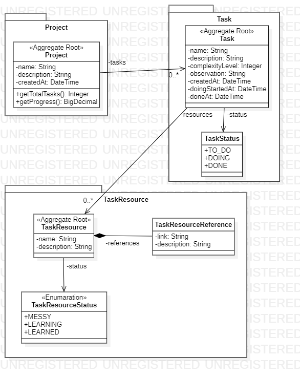

# Efficient Training Application



## Descrição

Esse projeto foi pensado e desenvolvido com intuito de treinar habilidades de desenvolvimento de APIs REST com Spring.

A ideia principal do funcionamento do sistema é registrar projetos para treinar programação, seguindo os seguintes(principais) passos:

1 - Criar um projeto:

POST em: /projects
```json
{
	"name": "Curso Spring Framework",
	"description": "Estudar o curso Spring Framework da Algaworks"
}
```

2 - Adicionar tarefas:

POST em: /tasks

```json
{
	"name": "Cadastrando Uma tarefa",
	"description": "Testando o cadastro de uma tarefa",
	"complexityLevel": 3,
	"project": {
		"id": 2
	}
}
```

2 - Adicionar recursos de tarefas:

POST em: /task-resources

```json
{
  "name": "Cadastrando Um recurso",
  "description": "Testando o cadastro de um recurso",
  "task": {
    "id": 1
  }
}
```

O Sistema possuí outros endpoints como mudar status de tarefa, adicionar links de referência para os recursos das tarefas, etc.

No momento é possível visualizar um exemplo dos endpoints existentes através de um arquivo .json exportado do Insomnia, podendo ser importado para testes.
[Insomnia JSON](https://github.com/armandodelcol-coder/efficient-training/blob/main/insomnia-json/efficient-training.json)
(A documentação completa dos endpoints será adicionada em breve pelo Swagger).

### Obs

O Sistema não se limita a cadastro de projetos para treinar programação, podendo ser utilizado para projetos de estudos de qualquer área ou projetos pessoais.